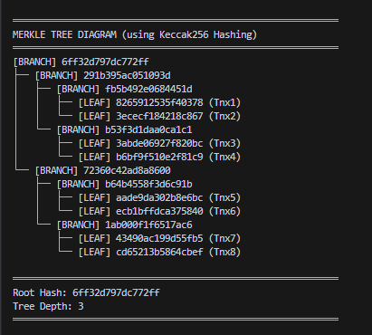

# Week 1 Web3Bridge Assignment

## Overview

This project implements a **Merkle Trie**, a fundamental data structure used in blockchain and Web3 technologies. A Merkle Trie combines the properties of two important data structures:

### What is a Merkle Trie?

A **Merkle Trie** is a hybrid data structure that merges:

- **Trie (Prefix Tree)**: A tree-based data structure used for efficient searching and storing of strings. Each node represents a character, and paths from root to leaf form complete strings.
- **Merkle Tree**: A hash tree where each node contains the cryptographic hash of its children. This ensures data integrity and is widely used in blockchain for efficient verification.

The Merkle Trie combines these concepts to create a data structure that:
- Efficiently stores and retrieves key-value pairs
- Provides cryptographic proofs for data verification
- Enables efficient state management (crucial for blockchain)
- Allows for compact representation of data with verifiable integrity

### Key Features

✓ Efficient string matching and retrieval  
✓ Cryptographic hashing for data integrity  
✓ Proof generation for blockchain applications  
✓ Optimal space and time complexity  

---

## Getting Started

### Prerequisites

Before running this project, ensure you have the following installed:

- **Node.js** (v14 or higher) - [Download Node.js](https://nodejs.org/)

You can verify your installation by running:

```bash
node --version
npm --version
```

### Installation

No additional dependencies are required for this project. Clone or download the project folder.

### Running the Project

To run the Merkle Trie implementation, execute the following command in your terminal:

```bash
node Trie.js
```

This will run the Trie implementation and display the results in your console.

---

## Project Structure

```
MerkleTrie/
├── Trie.js       # Main implementation of the Merkle Trie
├── README.md     # This file
└── image.png     # Visual representation of the Merkle Trie concept
```

---

## Understanding the Implementation

The `Trie.js` file contains the core implementation of the Merkle Trie structure. Refer to the image below for a visual understanding of how the structure works:




